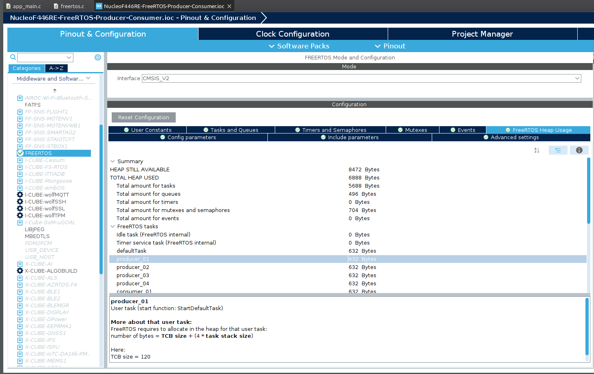
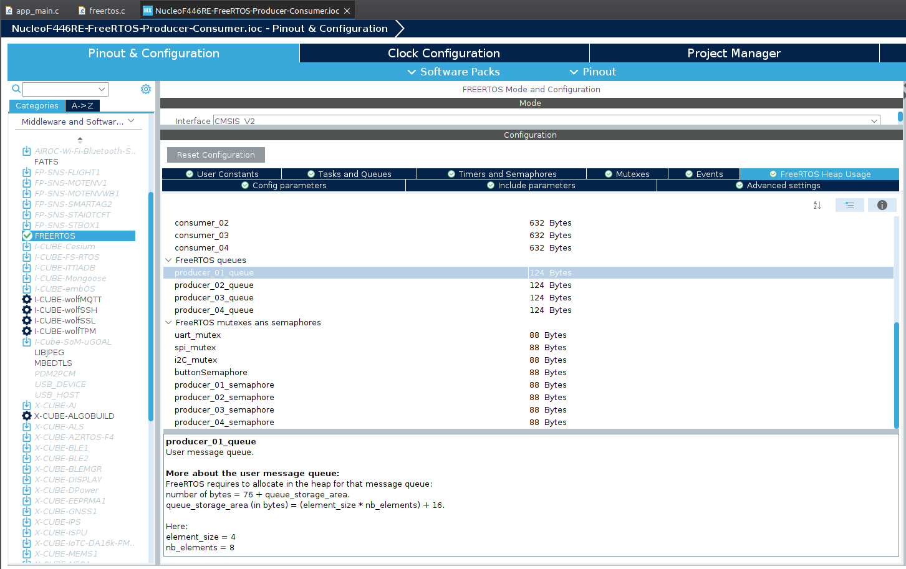
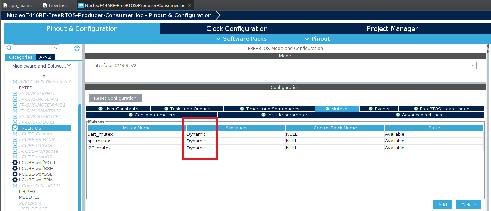
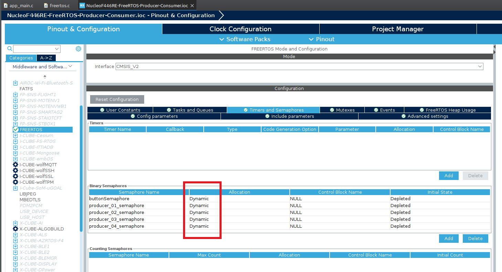
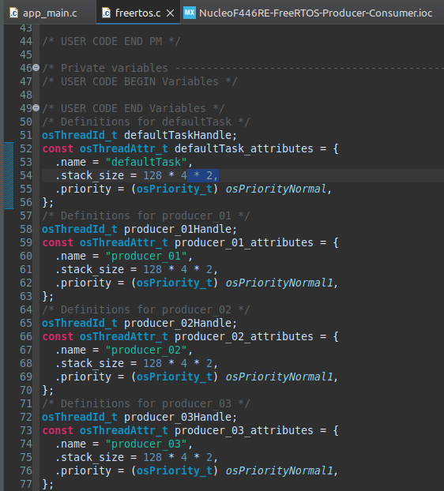
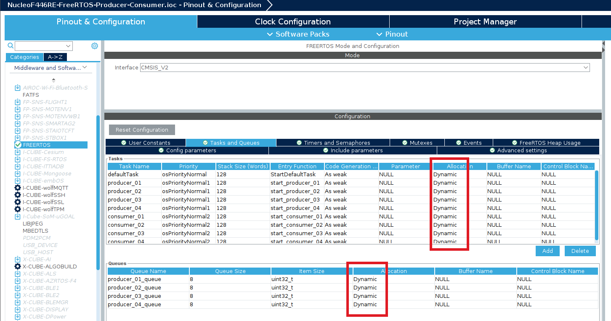

# learn-FreeRTOS
get to know FreeRTOS and code some basic examples using the STM32F4 microcontroller

Official Tutorial
[FreeRTOS Tutorial](https://github.com/FreeRTOS/Lab-Project-FreeRTOS-Tutorials)  

My Tutorial (cheat sheet) created with chatGPT
[cheat sheet](./Docs/README.md)   

## Basic Task Example

## Advanced Task Example with Producer Consumer Pattern
Disadvantage was the dynamic stack size which leads to stability issues.  

Fix this with increasing the stack size of each task by factor of 2. Increasing even mor results in only the ```defaultTask``` being executed.   


```C
/* USER CODE END Variables */
/* Definitions for defaultTask */
osThreadId_t defaultTaskHandle;
const osThreadAttr_t defaultTask_attributes = {
  .name = "defaultTask",
  .stack_size = 128 * 4 * 2,
  .priority = (osPriority_t) osPriorityNormal,
};
/* Definitions for producer_01 */
osThreadId_t producer_01Handle;
const osThreadAttr_t producer_01_attributes = {
  .name = "producer_01",
  .stack_size = 128 * 4 * 2,
  .priority = (osPriority_t) osPriorityNormal1,
};
...
```
  
  
  
  
  
  

## Advanced Task Example with Producer Consumer Pattern with static stack size